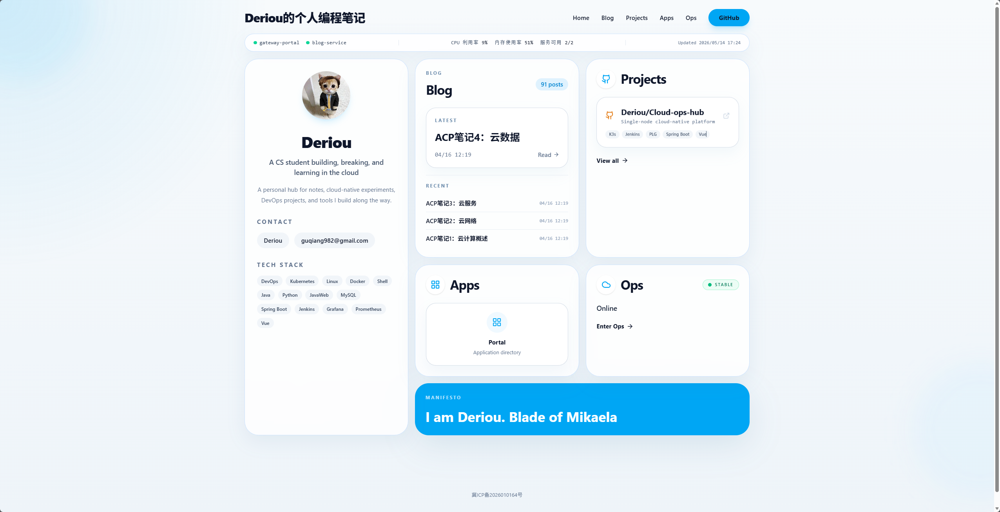
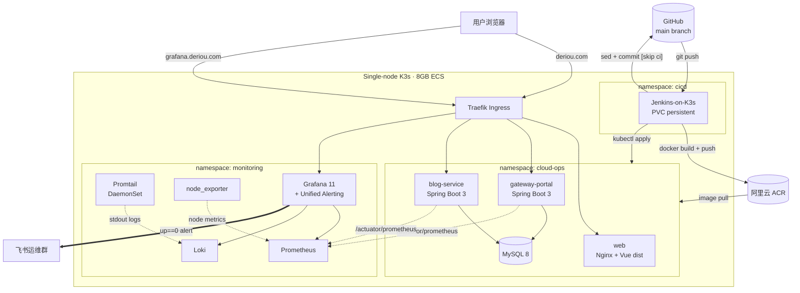
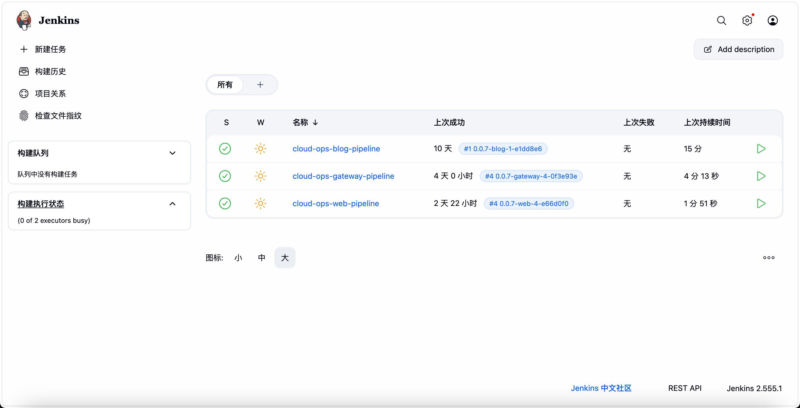
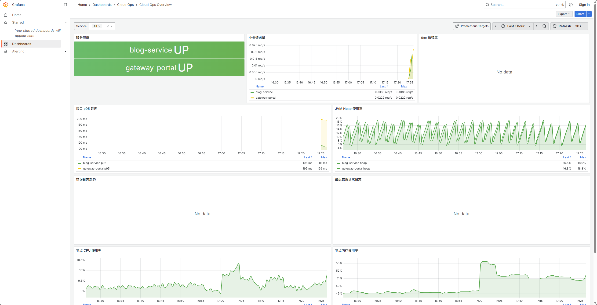
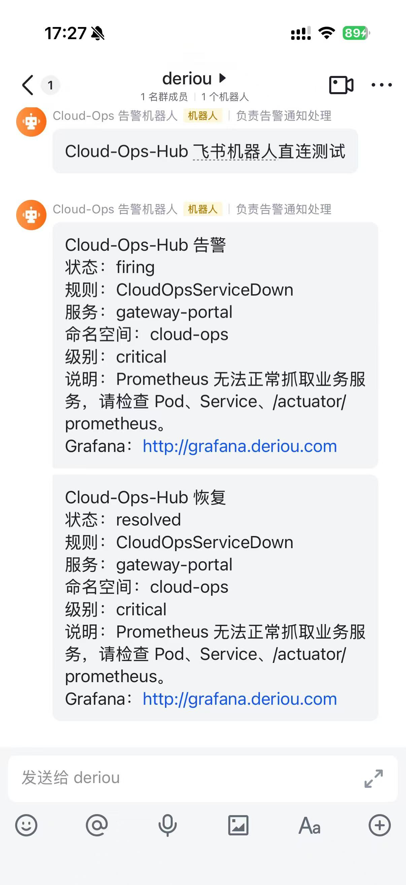

<div align="center">

# Cloud-Ops-Hub

**单节点 K3s 上的全栈云原生运维平台 · 8 GB 内存红线 · 完整 CI/CD + PLG 可观测性闭环**

[](LICENSE)
[](https://openjdk.org/projects/jdk/21/)
[](https://spring.io/projects/spring-boot)
[](https://vuejs.org/)
[](https://k3s.io/)
[](https://www.jenkins.io/)
[](https://grafana.com/)

**Live Demo** &nbsp;·&nbsp; [deriou.com](http://deriou.com) &nbsp;·&nbsp; [grafana.deriou.com](http://grafana.deriou.com)

</div>



---

## 这是什么

在阿里云一台 **8 GB 单节点 ECS** 上,从 0 自建并跑通的一套云原生运维平台:

- 3 个 Spring Boot 微服务 + 1 个 Vue 3 门户,声明式部署在 **K3s** 集群
- 3 条独立 **Jenkins Pipeline** 构成的 **GitOps** 自动化流水线
- **Prometheus + Loki + Promtail + Grafana** 全链路可观测性
- **Grafana Unified Alerting + 飞书机器人** 告警闭环
- 所有代码、配置、文档、决策记录公开

> **目标**:在最严苛的资源红线下,做出"能跑、能观测、能告警、能复现"的真实生产链路,作为运维开发 / SRE 方向的能力证明。

---

## 架构



---

## 三大核心能力

### 1. Jenkins-on-K3s · 三模块 GitOps 流水线



- 3 套独立 `Jenkinsfile` ([`Jenkinsfile.web`](Jenkinsfile.web) / [`Jenkinsfile.gateway`](Jenkinsfile.gateway) / [`Jenkinsfile.blog`](Jenkinsfile.blog)),每条 9 个 Stage 标准流程
- 镜像 tag 规则:`${版本前缀}-${BUILD_NUMBER}-${gitShortSha}`,**每次构建唯一可追溯**
- **核心设计:GitOps 自动回写**——Jenkins 构建完成后,自动 `sed` 替换 `infra/k8s/base/<module>/deployment.yaml` 中的镜像 tag,并以 `cloud-ops-jenkins` 身份 `git commit + push` 回 GitHub `main`(带 `[skip ci]` 防止递归),保证 **Git 期望状态 ≡ 集群实际运行版本**
- 运行时镜像 `eclipse-temurin:21-jre-alpine` 多阶段构建 < 120 MB,平均构建+发布 ≈ 3 min,具备 `kubectl rollout undo` 一键回滚能力

详细:[`docs/cicd/CICD_OPERATION_RUNBOOK.md`](docs/cicd/CICD_OPERATION_RUNBOOK.md) · [`docs/cicd/JENKINS_WEB_PIPELINE_DOCKER_DEPLOYMENT_GUIDE.md`](docs/cicd/JENKINS_WEB_PIPELINE_DOCKER_DEPLOYMENT_GUIDE.md)

---

### 2. PLG 全链路可观测性



- **指标层 (Prometheus)**:Spring Boot Actuator + Micrometer 暴露 JVM / HTTP / 虚拟线程指标;node_exporter 采集节点 CPU/内存;静态 scrape_configs ConfigMap 注入,比 Prometheus Operator 节省约 60% 内存
- **日志层 (Loki + Promtail)**:Promtail DaemonSet 无侵入采集 namespace 内所有 Pod 标准输出,LogQL 多标签检索
- **看板层 (Grafana 11)**:Helm `dashboardProviders` 声明式注入 `Cloud Ops Overview` 看板,公网匿名只读发布在 [grafana.deriou.com](http://grafana.deriou.com),**禁用匿名 Explore** 防止访客拉取日志明细
- **traceId 全链路**:请求入口注入 8 位 traceId,写入 MDC + 响应头 `X-Trace-Id` + 结构化日志——**1 个 traceId 即可在 Loki LogQL 串起完整调用链**

详细:[`docs/plg/PLG_03_PROMETHEUS_DEPLOYMENT_PLAN.md`](docs/plg/PLG_03_PROMETHEUS_DEPLOYMENT_PLAN.md) · [`docs/plg/PLG_04_LOKI_PROMTAIL_DEPLOYMENT_PLAN.md`](docs/plg/PLG_04_LOKI_PROMTAIL_DEPLOYMENT_PLAN.md) · [`docs/plg/PLG_05_GRAFANA_DASHBOARD_DEPLOYMENT_PLAN.md`](docs/plg/PLG_05_GRAFANA_DASHBOARD_DEPLOYMENT_PLAN.md)

---

### 3. 轻量告警 · Grafana Unified Alerting + 飞书 Webhook

<p align="left">
  
</p>

- **选型权衡**:8 GB 单机不愿额外起 Alertmanager Pod,选 **Grafana 11 内置 Unified Alerting**,**0 新增 Pod**
- **provisioning 声明式入仓**:Alert Rule / Contact Point / Notification Policy 全部以 YAML 注入,代码即配置
- **演示闭环**:`kubectl -n cloud-ops scale deploy/gateway-portal --replicas=0` → 60–90 s 内飞书运维群收到 `firing` 卡片,恢复后自动 `resolved`
- **飞书机器人签名校验 (HMAC-SHA256)**:Webhook 密钥走 K8s Secret + `envFrom`,**绝不入 Git**

详细:[`docs/plg/PLG_06_GRAFANA_FEISHU_ALERTING_PLAN.md`](docs/plg/PLG_06_GRAFANA_FEISHU_ALERTING_PLAN.md) · [`docs/plg/PLG_07_ALERTING_COMPLETION_DEMO_RUNBOOK.md`](docs/plg/PLG_07_ALERTING_COMPLETION_DEMO_RUNBOOK.md)

---

## 技术栈

| 层 | 技术 |
| --- | --- |
| **后端** | Java 21 (虚拟线程) · Spring Boot 3 · MyBatis-Plus · MySQL 8 · Caffeine |
| **前端** | Vue 3 (Composition API) · TypeScript · Vite · Pinia · Tailwind CSS · lucide-vue-next |
| **容器与编排** | Docker (Multi-stage, `jre-alpine`) · K3s · Traefik Ingress · Kustomize · Helm |
| **CI/CD** | Jenkins (Declarative Pipeline) · 阿里云 ACR · GitOps writeback |
| **可观测性** | Prometheus · Loki · Promtail · Grafana 11 · Micrometer · node_exporter |
| **告警** | Grafana Unified Alerting · 飞书自建机器人 Webhook (HMAC-SHA256) |

---

## 项目结构

```text
Cloud-ops-hub/
├── apps/                       # 后端业务模块
│   ├── gateway-portal/         #   公网入口 + 健康聚合
│   ├── blog-service/           #   博客域服务
│   └── ops-core/               #   规划中
├── common/
│   └── common-core/            # 统一 ApiResponse / BizException / GlobalExceptionHandler / AOP 日志
├── web/                        # Vue 3 Bento Dashboard 前端
├── infra/
│   ├── k8s/                    # K3s 声明式清单 (Kustomize base + overlays)
│   ├── helm/                   # Prometheus / Loki / Grafana / Promtail values
│   └── jenkins/                # Jenkins Dockerfile + 部署清单
├── docs/                       # 50+ 篇 runbook / handbook
│   ├── ARCHITECTURE.md
│   ├── DEPLOYMENT_PLAYBOOK.md
│   ├── OPS_RUNBOOK.md
│   ├── cicd/                   # CI/CD 全套 SOP (8 篇)
│   ├── plg/                    # 可观测性方案与告警 (7 篇)
│   ├── learning/               # 学习笔记 (6 篇)
│   ├── steps/                  # 步骤化交付记录 (14 篇)
│   └── web/                    # 前端方案
├── Jenkinsfile.web
├── Jenkinsfile.gateway
├── Jenkinsfile.blog
└── LICENSE
```

---

## 文档导航

- 架构总览:[`docs/ARCHITECTURE.md`](docs/ARCHITECTURE.md)
- 模块边界:[`docs/MODULES.md`](docs/MODULES.md)
- API 规范:[`docs/API_STANDARDS.md`](docs/API_STANDARDS.md)
- 部署 Playbook:[`docs/DEPLOYMENT_PLAYBOOK.md`](docs/DEPLOYMENT_PLAYBOOK.md)
- 运维 Runbook:[`docs/OPS_RUNBOOK.md`](docs/OPS_RUNBOOK.md)
- **CI/CD 全集**:[`docs/cicd/`](docs/cicd/)
- **可观测性全集**:[`docs/plg/`](docs/plg/)
- 完成度评估:[`docs/cicd/PROJECT_COMPLETION_ASSESSMENT.md`](docs/cicd/PROJECT_COMPLETION_ASSESSMENT.md)

---

## 快速浏览（部署速览）

> 完整步骤参考 [`docs/DEPLOYMENT_PLAYBOOK.md`](docs/DEPLOYMENT_PLAYBOOK.md),以下为最短演示路径。

```bash
# 1. 初始化 K3s + Traefik Ingress (8GB ECS)
curl -sfL https://get.k3s.io | sh -

# 2. 部署 MySQL + 业务三模块 (Kustomize)
kubectl apply -k infra/k8s/base/

# 3. 部署 PLG (Helm)
helm upgrade --install prometheus prometheus-community/prometheus \
  -n monitoring -f infra/helm/prometheus/values-dev.yaml
helm upgrade --install loki grafana/loki -n monitoring \
  -f infra/helm/loki/values-dev.yaml
helm upgrade --install promtail grafana/promtail -n monitoring \
  -f infra/helm/promtail/values-dev.yaml
helm upgrade --install grafana grafana/grafana -n monitoring \
  -f infra/helm/grafana/values-dev.yaml

# 4. 部署 Jenkins (cicd namespace)
kubectl apply -f infra/k8s/cicd/jenkins/

# 5. 在 Jenkins 配置 ACR + GitHub 凭据,点 Build Now 即可触发 GitOps 流水线
```

---

## 设计原则

1. **资源红线优先**——8 GB 单机,**不上 Alertmanager / Service Mesh / ELK**,选 Loki + Grafana Unified Alerting 等轻量替代。
2. **声明式优先**——所有 K8s 清单、Grafana Dashboard、Alert Rule、Contact Point 全部 YAML 入仓。
3. **GitOps 单一事实源**——Git 仓库即期望状态,Jenkins 流水线自动同步集群运行版本,杜绝手动 `kubectl apply` 漂移。
4. **可观测性友好**——后端 `common` 模块统一返回结构、异常体系、AOP 日志,前后端基于 traceId 联合排障。
5. **文档化**——每一次技术决策、踩坑、SOP 都沉淀进 `docs/`,50+ 篇 runbook/handbook 与代码同等重要。

---

## License

[MIT](LICENSE) © 2026 [Deriou](https://github.com/Deriou)

---

## Author

**Deriou**

- CS undergrad · Class of 2027
- [deriou.com](http://deriou.com)
- [github.com/Deriou](https://github.com/Deriou)

> Building, breaking, and learning in the cloud.
